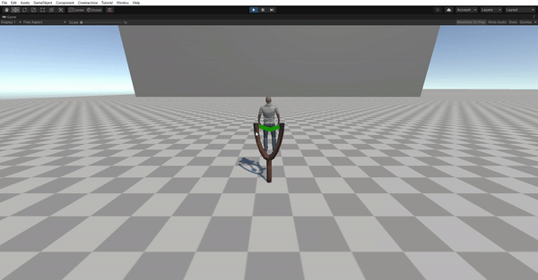

Github Repo for Gameguru Internship Case-2

**Introduction**

In Case-2 I had to create a 3D slingshot that shoots a character.

I have dealed with shooting the player by rigidbody addforce command. I have created a vector from startgin and ending mouse positions and passed that value to the rigidboyd addforce.

At OnMouseDrag function I have adjusted the player and the line renderer position on the slingshot.

Also at OnMouseDrag I called a function that is Trajectory, and in there I have created a line to represent where the player more or less would go.
http://hyperphysics.phy-astr.gsu.edu/hbase/traj.html#tracon I have used this websites to get some ideas about Trajectories.

